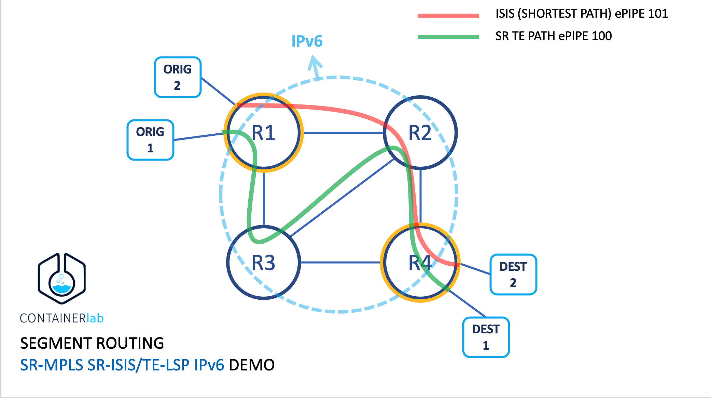

# Segment Routing Lab: SR-MPLS SR-ISIS/TE-LSP IPv6 Demo
# (work in progress...)

This lab is showing a simple configuration and verification of SR on Nokia routers to signal both IGP’s shortest path and TE LSPs similar to the capabilities of LDP and RSVP-TE MPLS transport label signaling protocols respectively. SR’s built-in capability for Fast ReRoute (FRR) using Loop-Free Alternate (LFA) is also shown

All router network interfaces for transport are <b>using IPv6</b>

## Network Setup

See topology on the next image:




We created two ePipes using different configurations
* non-TE LSP — R1 — R2 — R4 (i.e., the ISIS’ shortest path)
* TE LSP — R1 — R3 — R2 — R4 (i.e., the desired TE network path by the carrier for the ePipe service)

## Requeriments
Versions used are:
* containerlab 0.25.1
* vr-sros 22.5.R2 (requires license)

SROS image was created using [VR Network Lab](https://github.com/vrnetlab/vrnetlab)
IMPORTANT: vr-sos must be set as an image in docker to be pull directly by containerlab
```
# docker images | grep vr-sros
vr-sros                               22.5.R2                         f33cd7a3732a        3 months ago        965MB
```

## Overview

This lab is showing a simple configuration and verification of SR on Nokia routers to signal both IGP’s shortest path and TE LSPs similar to the capabilities of LDP and RSVP-TE MPLS transport label signaling protocols respectively. SR’s built-in capability for Fast ReRoute (FRR) using Loop-Free Alternate (LFA) is also shown

Lab built with containerlab to test sr-mpls using sr-isis.

An ePipe 100 is setup between R1 and R4 so that ORG1 and DEST1 connected to the Service Access Ports (SAPs) of the ePipe 100 can communicate with each other as the two PCs are on the same IP subnet of 10.10.10.0/24. Another ePipe 101 was created via TE LSP via a longer path between R1-R2-R3-R4 routers. Traffic Engineering (TE) is the capability where the path of each LSP can be manually defined hop-by-hop or signalled based on meeting certain QoS requirements instead of just following the IGP’s shortest path as in the case of LDP. 

More details of SR-MPLS, TE-LSP and Fast ReRoute (FRR) capability by pre-computing Loop-Free Alternate (LFA) paths, and other technologies used on this demo, check post: [Segment Routing with Nokia 7750 on GNS3 by Derek Cheung](https://derekcheung.medium.com/segment-routing-b69f6ea2e3f5)

If you are new with container lab, we recommed to check the post regading [Nokia SROS in the manual](https://containerlab.dev/manual/kinds/vr-sros/)


## Setting the lab
Use containerlab a specified topology
```
clab deploy --topo topo.yml
```
Checking elements in the lab
```
# clab inspect --topo topo.yml
INFO[0000] Parsing & checking topology file: topo.yml
+---+--------------------------+--------------+-----------------+---------+---------+----------------+----------------------+
| # |           Name           | Container ID |      Image      |  Kind   |  State  |  IPv4 Address  |     IPv6 Address     |
+---+--------------------------+--------------+-----------------+---------+---------+----------------+----------------------+
| 1 | clab-srmpls-destination1 | 9bd285d5be17 | alpine:latest   | linux   | running | 172.20.20.2/24 | 2001:172:20:20::2/64 |
| 2 | clab-srmpls-destination2 | 18fcb789408e | alpine:latest   | linux   | running | 172.20.20.7/24 | 2001:172:20:20::7/64 |
| 3 | clab-srmpls-origin1      | 0e3edd85ea0b | alpine:latest   | linux   | running | 172.20.20.3/24 | 2001:172:20:20::3/64 |
| 4 | clab-srmpls-origin2      | 08024876191f | alpine:latest   | linux   | running | 172.20.20.5/24 | 2001:172:20:20::5/64 |
| 5 | clab-srmpls-router1      | b1c4368dc299 | vr-sros:22.5.R2 | vr-sros | running | 172.20.20.4/24 | 2001:172:20:20::4/64 |
| 6 | clab-srmpls-router2      | e3583a56107f | vr-sros:22.5.R2 | vr-sros | running | 172.20.20.6/24 | 2001:172:20:20::6/64 |
| 7 | clab-srmpls-router3      | c3fd1648a679 | vr-sros:22.5.R2 | vr-sros | running | 172.20.20.8/24 | 2001:172:20:20::8/64 |
| 8 | clab-srmpls-router4      | 97a35e3939d0 | vr-sros:22.5.R2 | vr-sros | running | 172.20.20.9/24 | 2001:172:20:20::9/64 |
+---+--------------------------+--------------+-----------------+---------+---------+----------------+----------------------+
```

You have direct access (after one min) to management interface via ssh admin/admin
Remember to change the CLI to model-driven if this is still in Classic.
You can copy and paste router settings form yaml files directly to CLI after /configure path
```
A:admin@router4# configure global
INFO: CLI #2054: Entering global configuration mode

[gl:/configure]
A:admin@router4# card 1 {

*[gl:/configure card 1]
A:admin@router4#     card-type iom-v

*[gl:/configure card 1]
A:admin@router4#     mda 1 
## Rest of the lines have been ommitted
```

Optionally, you can set the origin and destination containers as follow:
```
docker exec -i clab-srmpls-origin1 sh -s < origin1_config.sh
docker exec -i clab-srmpls-destination1 sh -s < destination1_config.sh
docker exec -i clab-srmpls-origin2 sh -s < origin2_config.sh
docker exec -i clab-srmpls-destination2 sh -s < destination2_config.sh
```

And test connectivity
```
# docker exec -ti clab-srmpls-origin1 ping 10.10.10.102
PING 10.10.10.102 (10.10.10.102): 56 data bytes
64 bytes from 10.10.10.102: seq=0 ttl=64 time=1.806 ms
64 bytes from 10.10.10.102: seq=1 ttl=64 time=0.860 ms
64 bytes from 10.10.10.102: seq=2 ttl=64 time=0.763 ms
```


## Check status of services

Some commands have been done using <b>Classic command line management interface mode</b>

First, check all the routes are working:
```
A:admin@router1# show router route-table ipv6 all

===============================================================================
IPv6 Route Table (Router: Base)
===============================================================================
Dest Prefix[Flags]                            Type    Proto     Age        Pref
      Next Hop[Interface Name]                         Active     Metric
-------------------------------------------------------------------------------
fd00::1/128                                   Local   Local     05h13m02s  0
       system                                          Y            0
fd00::2/128 [L]                               Remote  ISIS      01h21m48s  18
       fe80::5054:ff:fee0:ca00-"toR2"                  Y            10
fd00::3/128 [L]                               Remote  ISIS      01h18m03s  18
       fe80::5054:ff:fe7d:5500-"toR3"                  Y            10
fd00::4/128 [L]                               Remote  ISIS      00h04m20s  18
       fe80::5054:ff:fe7d:5500-"toR3"                  Y            20
fd01::1:2:0/126                               Local   Local     05h12m51s  0
       toR2                                            Y            0
fd01::1:2:1/128                               Local   Host      05h12m51s  0
       toR2                                            Y            0
fd01::1:3:0/126                               Local   Local     05h12m50s  0
       toR3                                            Y            0
fd01::1:3:1/128                               Local   Host      05h12m50s  0
       toR3                                            Y            0
fd01::2:3:0/126 [L]                           Remote  ISIS      01h18m03s  18
       fe80::5054:ff:fe7d:5500-"toR3"                  Y            20
fd01::2:4:0/126 [L]                           Remote  ISIS      01h21m48s  18
       fe80::5054:ff:fee0:ca00-"toR2"                  Y            20
fd01::3:4:0/126 [L]                           Remote  ISIS      01h18m03s  18
       fe80::5054:ff:fe7d:5500-"toR3"                  Y            20
-------------------------------------------------------------------------------
No. of Routes: 11
Flags: n = Number of times nexthop is repeated
       B = BGP backup route available
       L = LFA nexthop available
       S = Sticky ECMP requested
       E = Inactive best-external BGP route
===============================================================================
```

Check prefixes
```
A:admin@router1# /show router isis prefix-sids

===============================================================================
Rtr Base ISIS Instance 0 Prefix/SID Table
===============================================================================
Prefix                            SID        Lvl/Typ    SRMS   AdvRtr
                                   Shared                MT     Flags
-------------------------------------------------------------------------------
fd00::1/128                       1          2/Int.      N     router1
                                      No                    0      NnP
fd00::2/128                       2          2/Int.      N     router2
                                      N.A.                  0      NnP
fd00::3/128                       3          2/Int.      N     router3
                                      N.A.                  0      NnP
fd00::4/128                       4          2/Int.      N     router4
                                      N.A.                  0      NnP
-------------------------------------------------------------------------------
No. of Prefix/SIDs: 4 (4 unique)
-------------------------------------------------------------------------------
```

To make sure the ISIS config is working, run the following commands to verify ISIS adjacency and routing table.

```
A:router1# show router isis adjacency

===============================================================================
Rtr Base ISIS Instance 0 Adjacency
===============================================================================
System ID                Usage State Hold Interface                     MT-ID
-------------------------------------------------------------------------------
router2                  L2    Up    22   toR2                          0
router3                  L2    Up    20   toR3                          0
-------------------------------------------------------------------------------
Adjacencies : 2
===============================================================================
```

LSP signaled by SR-ISIS will simply follow the ISIS’ shortest path between R1 and R4. The following commands verify that the shortest path (non-TE) LSP is created between R1 and R4 so that we can use it for our ePipe 100

```
A:router1# oam lsp-ping sr-isis prefix fd00::4/128
LSP-PING fd00::4/128: 116 bytes MPLS payload
Seq=1, send from intf toR3, reply from fd00::4
       udp-data-len=32 ttl=255 rtt=1.28ms rc=3 (EgressRtr)

---- LSP fd00::4/128 PING Statistics ----
1 packets sent, 1 packets received, 0.00% packet loss
round-trip min = 1.28ms, avg = 1.28ms, max = 1.28ms, stddev = 0.000ms
A:router1# oam lsp-trace sr-isis prefix fd00::4/128
lsp-trace to fd00::4/128: 0 hops min, 0 hops max, 164 byte packets
1  fd00::3  rtt=1.27ms rc=8(DSRtrMatchLabel) rsc=1
2  fd00::4  rtt=1.31ms rc=3(EgressRtr) rsc=1
```

The TLDP session for signaling the service tunnel for ePipe 100 between R1 and R4, and ePipe 101 through the TE path are established. Check it via the following command.

```
A:router1#  /show service sdp-using

===============================================================================
SDP Using
===============================================================================
SvcId      SdpId              Type   Far End              Opr   I.Label E.Label
                                                          State
-------------------------------------------------------------------------------
100        4:100              Spok                        Down  524283  524283
                                     fd00::4
101        5:101              Spok                        Up    524284  524284
                                     fd00::4
-------------------------------------------------------------------------------
Number of SDPs : 2
-------------------------------------------------------------------------------
===============================================================================
```

LSP Trace through the TE LSP shows that traffic from R1 to R4 goes through R3 and R2. We can see TE Path is working via the following commands

```
*A:router1# oam lsp-trace sr-te "lsp_R1-R4-TE"

*A:router1# show router mpls sr-te-lsp "lsp_R1-R4-TE" path detail

```
The SR Adjacency-SID (524285 and 524287) is same as the labels specified in the command — show router mpls sr-te-lsp “lsp_R1-R4-TE” path detail.
The following shows the LFA pre-computed for each destination:

```
*A:router1# show router fp-tunnel-table 1
````